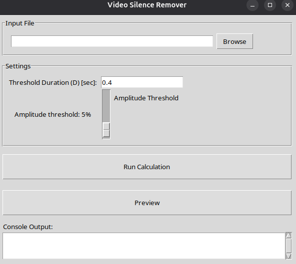

## Table of Contents

- [About The Project](#about-the-project)
  - [Why use this?](#why-use-this)
  - [Built With](#built-with)
- [Installation](#installation)
  - [Prerequisites](#prerequisites)
    - [Windows](#windows)
    - [Mac OS](#mac-os)
    - [Ubuntu](#ubuntu-debian-linux-mint-kali-linux)
    - [Fedora](#fedora)
    - [ArchLinux](#arch-linux-manjaro-endeavouros)
    - [Fedora](#fedora)
  - [Module Installation through Pip](#module-installation-through-pip)
- [Usage](#usage)
  - [Quick Start](#quickstart-with-ui)
  - [Advanced Use](#advanced-use)
- [Information](#information)
  - [Contact](#contact)
  - [Citation](#citation)

---

## About The Project

English: 
Raw video footage can be a hassle to process; and in particular long periods of
silences can be superfluous.
The goal of this Python module is to provide a tool to remove video footage from the "silent part".
This can be used by humans to increase density of information of their video,
or to train AI models only on unsilenced part. 
It revolves heavily around "ffmpeg".

Français: L'édition vidéo peut être complexe à traiter; en particulier les longues périodes de silence peuvent être superflues. Le but de ce module Python est de fournir un outil pour retirer d'un fichier vidéo la "partie silencieuse". Ce module peut utiliser ce module pour augmenter la densité d'information, ou pour entraîner des modules d'intelligence artificielle seulement sur la partie sans silences. Ce module est construit autour de l'outil "ffmpeg".

Chinese: 视频剪辑可能非常复杂；尤其是一些长时间的静音片段往往是不必要的。这个 Python 模块旨在提供一个工具，用于从视频文件中移除“静音部分”。该模块可用于提高信息密度，或仅使用静音部分来训练人工智能模块。该模块基于“ffmpeg”工具构建。

### Why use this?

English: At the time of writing, I did not find a comprehensive tooling that offered a UI that satisfied me.
In particular, the ability to preview the analysis seems lack a lacking capability of other tools.

Français: Au moment de la publication, je n'ai pas trouvé d'outil complet qui offre une interface utilisateur satisfaisant.
En particulier, la fonctionnalité de pouvoir prévisualiser l'analysis me semble manquante dans les autres outils.

Chinese: 截至发稿时，我尚未找到一款功能全面且用户界面令人满意的工具。尤其值得注意的是，其他工具似乎都缺乏分析预览功能。

### Built With

*   [Python](https://www.python.org/)
*   [Numpy](https://numpy.org/)
*   [Scipy](https://scipy.org/)
*   [Matplotlib](https://matplotlib.org/)

## Installation

### Prerequisites

It is mandatory to install FFPmpeg in addition to this module:

#### Windows
Download the installer in the [Downloads](https://ffmpeg.org/download.html) page.

#### Mac OS
Download the installer in the [Downloads](https://ffmpeg.org/download.html) page.

#### Ubuntu, Debian, Linux Mint, Kali Linux

Please use the following command:
```bash
sudo apt update
sudo apt install ffmpeg
```

#### Fedora

Please use the following command:
```bash
sudo dnf install ffmpeg-free
```


#### Arch Linux, Manjaro, EndeavourOS

Please use the following command:
```bash
sudo pacman -S ffmpeg
```

### Module installation through Pip

Recommended installation method:

```bash
pip install silence_remover_ad
```


# Usage

## Quickstart with UI

```python
import tkinter as tk
from src.silence_remover_ad import AppController

root = tk.Tk()
app = AppController(root)
root.mainloop()
```
English: This summons a user interface in which the user can:
- Select the input video file;
- Change the amplitude threshold for the detection of silence (as a percentage of the maximum amplitude);
- Change the silence duration threshold (time absolute);
- Preview the thresholds with a matplotlib chart which displays the amplitude of the video as a function of time, as well as the sections to be removed from the file;
- Run the ffmpeg command to create a new video file.

Français:
Ce code invoque une interface utilisateur qui permet à l'utilisateur de:
- Sélectionner un fichier vidéo d'entrée
- Changer le seuil d'amplitude maximum pour la détection du silence (relatif au pourcentage de l'amplitude maximum)
- Changer le seuil de la durée de silence admissible (temps absolu)
- Prévisualiser les seuils avec une figure matplotlib qui affiche l'amplitude de la vidéo en fonction du temps, ainsi que les sections à tronquer du fichier;
- Lancer la commande "ffmpeg" pour créer un nouveau fichier vidéo.

Chinese:
这段代码会调用一个用户界面，允许用户执行以下操作：

- 选择输入视频文件

- 更改静音检测的最大振幅阈值（相对于最大振幅的百分比）

- 更改允许的静音持续时间阈值（绝对时间）

- 使用 matplotlib 图表预览阈值，该图表会显示视频振幅随时间的变化，以及要从文件中截断的部分；

- 运行ffmpeg命令以创建新的视频文件。



English: The output file will be in the same folder with a suffix "_trimmed" in the video filename.

Français: Le fichier de sortie sera situé dans le même dossier que le fichier d'entrée avec le suffixe "_trimmed" dans le nom du fichier.

Chinese: 输出文件将位于与输入文件相同的文件夹中，文件名后缀为“_trimmed”。

## Advanced Use

English: You can directly use the VideoProcess class:
- Get video duration from the video file path
- Extract an audio file from the video file path
- Start the processing in command form instead of the user interface

Français: Vous pouvez utiliser la classe VideoProcess:
- Obtenir la durée d'une vidéo à partir du chemin vers le fichier vidéo
- Extraire le fichier audio à partir du chemin vers le fichier vidéo
- Commencer le traitement sous la forme de ligne de commande à la place de le lancer à travers l'interface utilisateur)

Chinese: 您可以使用 VideoProcess 类执行以下操作：

- 从视频文件路径获取视频时长

- 从视频文件路径提取音频文件

- 从命令行启动处理，而不是通过用户界面启动

```python
from src.silence_remover_ad import VideoProcessor

file_path = "./test_video.mp4"

# Gets the duration in seconds of a video file
duration = VideoProcessor._get_video_duration(file_path)

audio_output_path = "./output.wav"

video_processor_instance = VideoProcessor()

# Generate the audio file from a video file.
video_processor_instance.extract_audio(file_path, audio_output_path)

# Start the processing with default output filename
video_processor_instance.process_video(file_path,
                                       threshold_a=0.05,  # Relative threshold of amplitude
                                       threshold_d=0.9  # Time in seconds
                                       )

# Start the processing with default output filename

video_output_path = "./output.mp4"
video_processor_instance.process_video(file_path,
                                       threshold_a=0.05,  # Relative threshold of amplitude
                                       threshold_d=0.9,  # Time in seconds
                                       output_file=video_output_path
                                       )


```


# Information

## Contact

Alexandre Delaisement
## Citation

If you use this software in a scientific publication, please cite it as:

```bibtex
@misc{silence_remover_ad,
  author = {Alexandre, Delaisement},
  title = {silence_remover_ad},
  year = {2025},
  publisher = {GitHub},
  journal = {GitHub repository},
  }
```